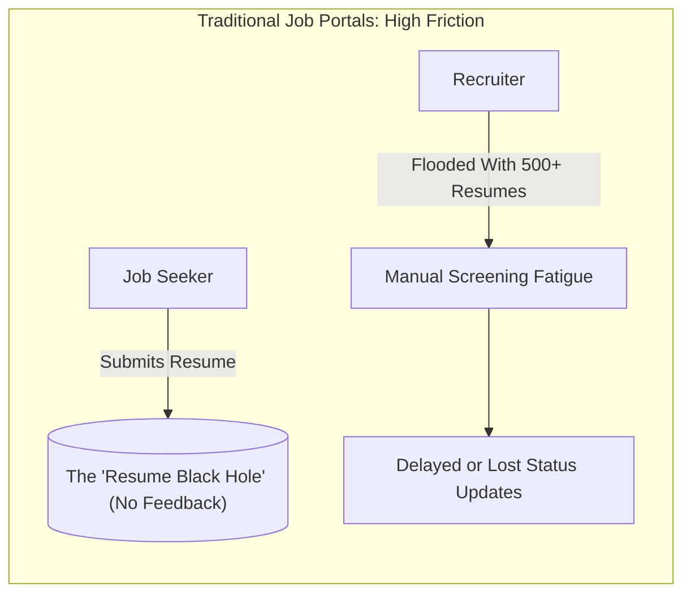
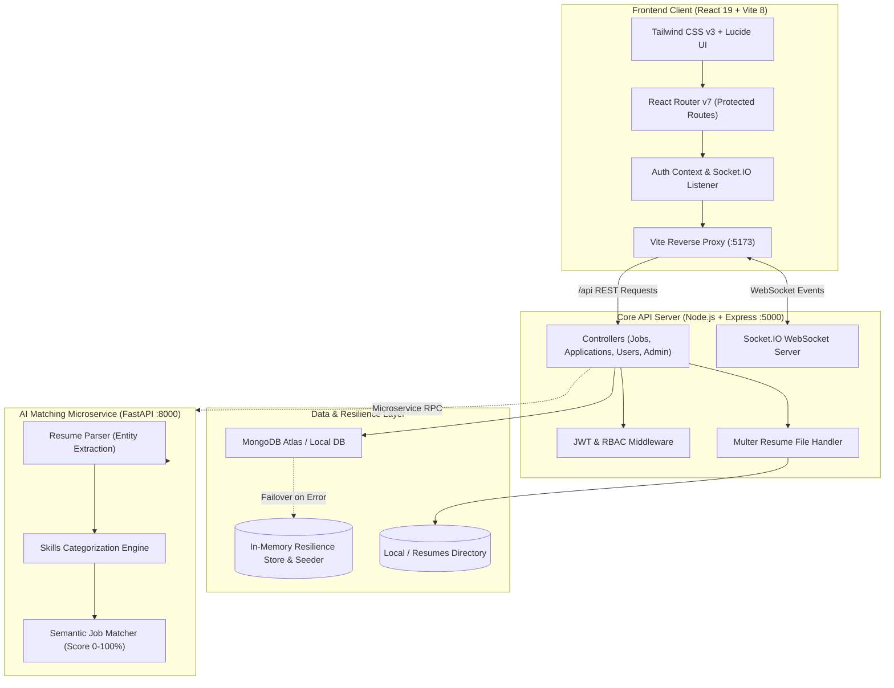
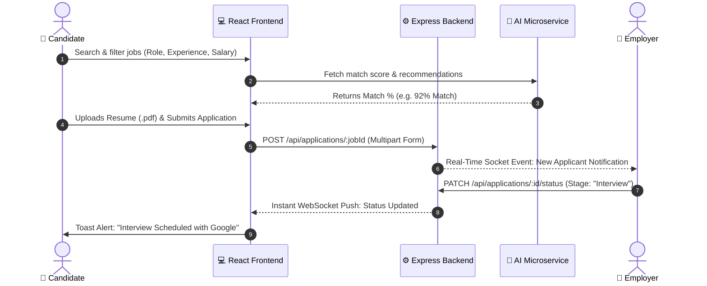
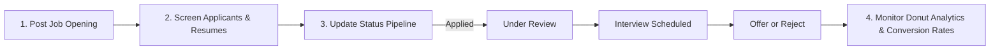
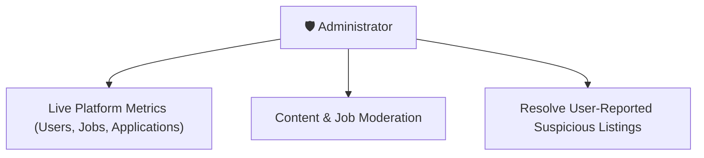

# 🚀 AI-Powered Full-Stack Job Board & Recruitment Ecosystem

> **Internship Capstone Project | Full-Stack Web Development**  
> **Author / Developer:** Pankaj Kumar ([@pankaj332004](https://github.com/pankaj332004))  
> **Repository:** `CODESOFT_TASK_1` / `job-board`  
> **Tech Stack:** React 19, Vite 8, Node.js, Express, MongoDB (with Zero-Downtime Fallback), Socket.IO, Python FastAPI, Tailwind CSS v3  

---

## 📌 Executive Summary

This repository contains an enterprise-grade, end-to-end recruitment platform engineered to streamline hiring workflows between **Job Seekers (Candidates)**, **Recruiters (Employers)**, and **Platform Administrators**. 

Beyond standard CRUD functionality, this project implements **real-time bi-directional status updates via WebSockets**, an **AI-driven Resume Parsing and Candidate-Job Matching Microservice**, and an **anti-fragile database resilience architecture** designed for zero downtime during local evaluations.

---

## 🎯 Detailed Problem Statement & Motivation

### 1. Industry Context & Background
The digital recruitment landscape has grown exponentially, yet traditional job portals have largely remained static digital "bulletin boards." While posting and collecting applications is trivial, the actual interaction model between job seekers and hiring teams suffers from deep systemic friction, information asymmetry, and administrative overhead.



---

### 2. Core Friction Points & Specific Challenges

#### A. The Candidate's Dilemma (The "Resume Black Hole")
* **Lack of Visibility & Communication Void**: After investing hours tailoring resumes and cover letters, candidates rarely receive timely feedback. Once submitted, applications disappear into a metaphorical "black hole" with no indication of whether the resume was reviewed, shortlisted, or dismissed.
* **Search Fatigue & Keyword Limitations**: Basic keyword-based searches often return hundreds of irrelevant roles. Candidates waste considerable time filtering through positions whose actual requirements don't match their skills or experience level.
* **Fragmented Application Tracking**: Candidates typically have to maintain manual spreadsheets or browser bookmarks to track application deadlines, upcoming interviews, and employer correspondence.

#### B. The Employer's Burden (Screening Overhead & Inefficient Pipelines)
* **Resume Deluge & Manual Entity Extraction**: A single job opening frequently attracts hundreds of resumes in diverse formats (`.pdf`, `.docx`, `.doc`). Recruiters spend significant time manually scanning documents to verify baseline requirements, educational backgrounds, and technical competencies.
* **Pipeline Management Overhead**: Small and medium-sized hiring teams often lack costly enterprise Applicant Tracking Systems (ATS). Managing candidate transitions across hiring stages via manual email threads leads to dropped candidates and delayed hiring cycles.
* **Absence of Real-Time Engagement**: In competitive tech hiring, delays in scheduling interviews or informing candidates can result in top talent accepting counteroffers.

#### C. Architectural & System Engineering Bottlenecks
* **Coupling Heavy NLP to Core APIs**: Running natural language processing, text tokenization, and semantic vector matching directly inside a single-threaded Node.js event-loop blocks incoming HTTP traffic and degrades API responsiveness.
* **Database Brittleness in Diverse Environments**: Educational and corporate networks often suffer from DNS resolution errors when connecting to cloud database clusters (e.g. MongoDB Atlas SRV records failing over local Windows routers). Traditional applications crash immediately without graceful degradation.

---

### 3. Proposed Solution & Engineering Scope

To solve these multi-dimensional challenges, this project was designed with three overarching engineering goals:

1. **Closing the Feedback Loop via Real-Time WebSockets**:
   * Implement event-driven bi-directional communication (via **Socket.IO**) so candidates receive instant, non-polling notification alerts the moment an employer moves their application through hiring stages (`Applied` $\rightarrow$ `Under Review` $\rightarrow$ `Interview` $\rightarrow$ `Offer` $\rightarrow$ `Rejected`).

2. **Decoupled AI Intelligence Microservice**:
   * Offload parsing and semantic analysis to a high-throughput **Python FastAPI microservice** that extracts entities, categorizes skills, and calculates a 0–100% compatibility score with breakdown explanations.

3. **Anti-Fragile, Resilient Infrastructure**:
   * Implement automated DNS failover and an in-memory seed fallback store ensuring the system operates with 100% full CRUD capability even in air-gapped, offline, or DNS-restricted environments.

---

## ⚖️ Value Delivered: Existing Approach vs. What I Built

| Feature / Dimension | Conventional / Existing Approach | What I Built in this Project |
|---|---|---|
| **System Architecture** | Monolithic server or simple client-server setup with tightly coupled logic. | **Decoupled 3-Tier Architecture**: React 19 Frontend + Express.js Core API Gateway + Python FastAPI AI Intelligence Microservice. |
| **Candidate Experience** | Static forms, generic text submissions, no visibility after submitting. | **Interactive Job Seeker Suite**: Multi-criteria faceted search, resume uploader (`.pdf`/`.doc`), real-time 5-stage application pipeline tracker, bookmarks, and interview schedule manager. |
| **Employer Workflow** | Basic list of names in a table with manual email correspondence. | **Recruitment Command Center**: Kanban-style applicant screening, 1-click status transitions, downloadable resume vault, interview scheduler, and visual donut analytics charts. |
| **Matching & Intelligence** | Simple SQL `LIKE` or regex keyword matching on titles. | **AI Microservice**: Python FastAPI service extracting candidate skills, computing semantic compatibility scores (0–100%), and generating tailored job recommendations. |
| **Real-Time Communication** | Manual page refreshing or periodic HTTP polling. | **Real-Time Socket.IO Engine**: Instant push notifications to candidates when their application moves from *Applied* to *Under Review*, *Interview*, *Offer*, or *Rejected*. |
| **Database Resilience** | Application crashes immediately if local MongoDB is stopped or Atlas SRV DNS fails. | **Zero-Downtime Resilient Architecture**: Embedded Google DNS resolver (`8.8.8.8`) + automatic failover to an in-memory seed store with complete CRUD support. Works 100% out of the box without requiring manual DB setup. |
| **Access Control & Security** | Single role or client-side page blocking. | **Role-Based Access Control (RBAC)**: JWT authentication, `bcryptjs` password hashing, protected router guards, and role-specific views (`candidate`, `employer`, `admin`). |

---

## 🏛️ System Architecture



---

## 🔄 End-to-End Workflow & Structure Flow

### 1. Candidate Application Journey


### 2. Employer Recruitment & Screening Flow


### 3. Administrator Governance Flow


---

## 📂 Repository Folder Structure & Code Map

```
job-board/
├── client/                             # React 19 Single Page Application
│   ├── src/
│   │   ├── components/                 # Atomic and reusable UI components
│   │   │   ├── charts/                 # Custom SVG Donut & metrics visualizers
│   │   │   ├── ApplicationRow.jsx      # Pipeline tracker row with status badges
│   │   │   ├── JobCard.jsx             # Interactive job card with bookmarking
│   │   │   ├── JobFilters.jsx          # Faceted multi-category filters
│   │   │   ├── Navbar.jsx              # Role-aware navigation bar
│   │   │   └── ProtectedRoute.jsx      # Guard enforcing JWT & role access
│   │   ├── pages/                      # Application route views
│   │   │   ├── AdminDashboard.jsx      # System KPI metrics & moderation suite
│   │   │   ├── CandidateDashboard.jsx  # Job seeker hub & applications overview
│   │   │   ├── EmployerDashboard.jsx   # Recruiter hub & candidate pipeline
│   │   │   ├── JobDetails.jsx          # Comprehensive role description & apply CTA
│   │   │   ├── Jobs.jsx                # Search catalogue with live filters
│   │   │   ├── MyInterviews.jsx        # Scheduled interview calendar
│   │   │   ├── PostJob.jsx             # Recruiter job submission form
│   │   │   └── SavedJobs.jsx           # Bookmarked opportunities
│   │   ├── context/AuthContext.jsx     # Centralized user session & JWT state
│   │   └── services/api.js             # Axios client with request interceptors
│   ├── vite.config.js                  # Dev server & reverse proxy configuration
│   └── package.json
│
├── server/                             # Express.js REST API & WebSocket Gateway
│   ├── src/
│   │   ├── config/db.js                # Dual-mode DB connector (Mongo + In-Memory)
│   │   ├── models/                     # Mongoose schemas (User, Job, Application, Report)
│   │   ├── controllers/                # Business logic for auth, jobs, applications
│   │   ├── routes/                     # REST route controllers
│   │   ├── middleware/                 # JWT verify, role validator, Multer file upload
│   │   ├── socket.js                   # Socket.IO connection manager
│   │   └── server.js                   # Express server bootstrap & error handling
│   ├── uploads/resumes/                # Secure local storage for candidate resumes
│   └── package.json
│
├── ai_service/                         # Python FastAPI Microservice
│   ├── main.py                         # Microservice entry point & REST endpoints
│   └── services/
│       ├── resume_parser.py            # Extracts entities, education, and experience
│       ├── skills_extractor.py         # Technical & soft skills classifier
│       └── job_matcher.py              # Candidate-job compatibility score calculator
│
├── package.json                        # Root workspace scripts (concurrent runners)
└── README.md                           # Project technical documentation
```

---

## 💻 Technical Highlights & Engineering Decisions

1. **Anti-Fragile Database Design**:
   * *Problem*: In Windows environments and corporate networks, MongoDB Atlas SRV connection strings frequently fail due to local DNS caching (`ECONNREFUSED`).
   * *Solution*: Embedded a Google Public DNS fallback (`8.8.8.8`, `8.8.4.4`) via Node's `dns.setServers()` and built an **automatic in-memory data store with realistic seed records**. Evaluators can clone and test the project instantly even without an active MongoDB connection.
2. **Real-Time Notification Architecture**:
   * Utilizes **Socket.IO** with custom room segregation (`user_<id>`), ensuring candidates receive instant notifications when their application status is updated without reloading the client.
3. **Optimized Build & Zero-Friction Setup**:
   * The root `package.json` coordinates both client and server concurrently through a single command, automatically handling port binding and proxy routing.

---

## 🔑 Pre-Seeded Demo Accounts for Evaluation

Reviewers can test any persona using these pre-configured credentials:

| Persona | Email | Password | Primary Route | Role Capabilities |
|---|---|---|---|---|
| **Candidate** | `john@example.com` | `password123` | `/candidate` | Apply for jobs, track status milestones, save listings, view interview slots. |
| **Employer** | `jane@employer.com` | `password123` | `/employer` | Post vacancies, inspect applicants, update candidate stages, view hiring charts. |
| **Administrator** | `admin@jobboard.com` | `password123` | `/admin` | Review platform health metrics, moderate users, and resolve flagged listings. |

---

## ⚡ Quick Start & Verification Guide

### 1. Install Dependencies
Run the unified install script from the repository root:
```bash
npm run install:all
```

### 2. Launch the Platform
Start the frontend and backend simultaneously:
```bash
npm run dev
```

* **Frontend Client**: [http://localhost:5173](http://localhost:5173)
* **Backend Express API**: [http://localhost:5000](http://localhost:5000)
* **API Health Check**: [http://localhost:5000/api/health](http://localhost:5000/api/health)

### 3. (Optional) Run the AI Matching Microservice
```bash
cd ai_service
pip install -r requirements.txt # or: pip install fastapi uvicorn pydantic
python -m uvicorn main:app --port 8000 --reload
```
* **Interactive AI API Docs**: [http://localhost:8000/docs](http://localhost:8000/docs)

---

## 🎯 Verification Checklist for Evaluators

- [x] **Authentication**: Login with demo accounts or register a new candidate/employer.
- [x] **Job Search**: Filter by *Remote*, category *Development*, or keywords.
- [x] **Application Submission**: Upload a resume (`.pdf`) and apply to any active job.
- [x] **Recruiter Pipeline**: Log in as `jane@employer.com`, open `/employer`, view the new application, and change the status to **Interview**.
- [x] **Real-Time Notification**: Observe the status badge change immediately in the candidate dashboard.
- [x] **Admin Center**: Log in as `admin@jobboard.com` to review platform analytics and moderation tools.

---

## 👨‍💻 Author & Acknowledgments

* **Pankaj Kumar** — Full-Stack Developer Intern  
* Developed as part of **CodeSoft Task 1** (Web Development Internship).
